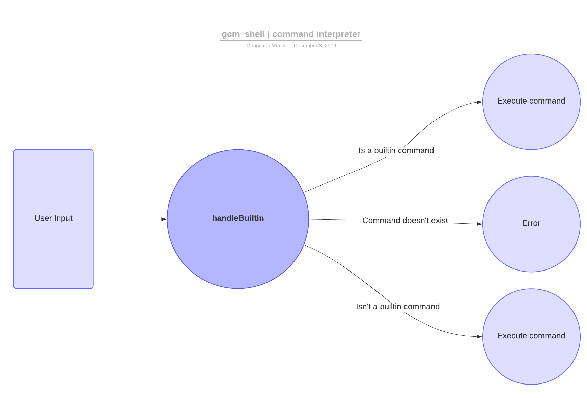
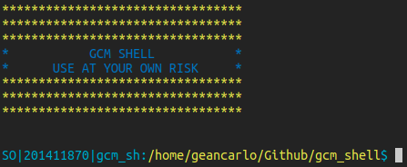
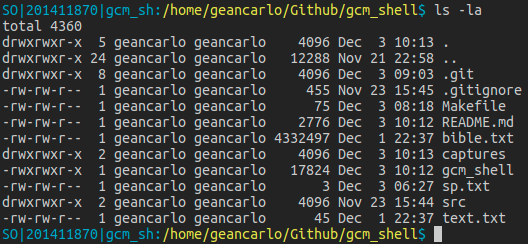
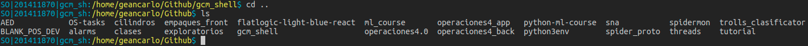
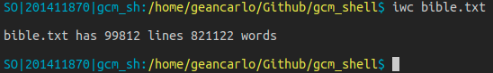
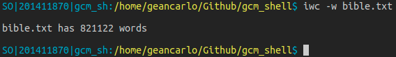
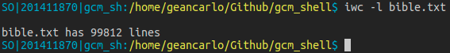
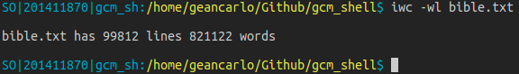
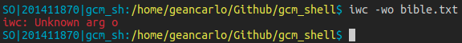

# gcm_shell

## How to compile and use

- Compile
``` bash
$ make
```

- Start interpreter
``` bash
$ ./gcm_shell
```

## Desing Overview

The code is structured in some functions, ones for handle user inputs,
main loop and iwc (builtin version of wc).

### Functions for handle user interactions
- `my_read_line` : Get the line from stdin, with a maximum size (bufsize)
- `my_split_line` : Split a given line and return an array of those tokens. The last item always is NULL.
- `my_exec` : Execute files using execvp function, given a array terminated with a NULL element.
- `help` : Show in stdin a little help message.
- `handleBuiltin` : Handle the interaction of the user with the command line.
- `my_loop` : Main loop of command line program.

### Functions for iwc implementation
- `count_lines` : Thread function for count lines. Given an FD as argument. Using fgets to get line by line.
- `count_words` : Thread function for count words. Given a FD as argument. Use strtok to split the lines and get words to count.
- `iwc` : Builtin version for wc. Use two flags -w and -l, using threads
   * **-w** flag prints in stdin the number of words in a given file.
   * **-l** flag prints in stdin the number of lines in a given file.
  
## How to handle ambiguities?
### User Interactions.
The user may have errors when entering an instruction, that is why each line entered, a split is made by spaces to get tokens that describe the file or program to execute and the args. This implementation allows to valid the double spaces separation between args, for example.

### No builtin commands and args.
The gcm_shell execute files or programs using `execvp` function that allows to specify the file to execute and pass an array with args for that file. This allows to the user to use flags for many programs.

### iwc, blank multilines, words and threads.
In the first try, to count the words, we were looking for spaces and new lines chars to count, but it returned some false positive, for example: If it was a blank file with only `\n`, each `\n` was counted has a word. 

In the next try, using threads, one was assinged to count lines, and other words. The count lines was easier, to get line by line using `fgets` and increment the counter. For words, we get each line and split the line for `spaces`, this allows to count trully words.

## Important design decisions
To implement the shell, thinking in interactions, only execute files or programs is not enough, the user should know where is located. For that reason is presented in prompt the current working directory.

To implement `iwc`, the idea is to valid the flags. The user can list the flags in a single flag, like `-wl` or `-lw` to use both. If an unknow flag is mentioned, it returns an error message. 

## Diagrams




## Captures

















> Geancarlo Murillo Mendoza